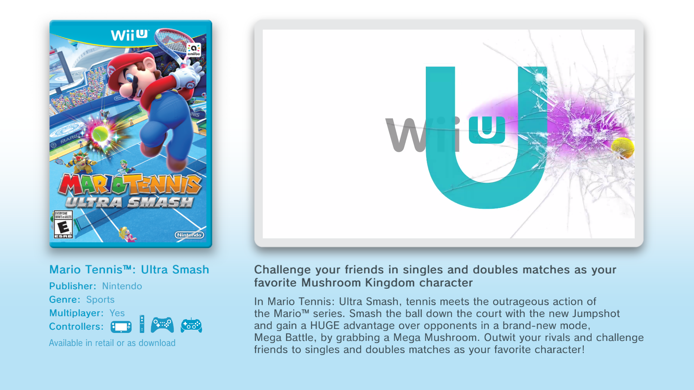

# Retail Wii U Kiosk Menu

Run the **CAT-I Kiosk Menu** on a retail Wii U. This is **Kiosk Menu**, not a full kiosk OS. You open it from **System Config Tool (SCT)** after merging kiosk licenses onto SLC and uploading the menu (and demos) to MLC

**No dumps or tickets** in this repo. You supply your own CAT-I extract.

  
  

## Warnings

- Bad SLC/MLC writes can soft-brick. Back up **OTP / SLC / SLCCMPT** (and saves) first.
- First Kiosk Menu use creates user **Sarah** over the main account.
- Keep **retail Home Menu** as default boot so FTP still works. Coldbooting Kiosk Menu traps you (no Home → no FTP).
- **Don’t** use WiiUIdent **Submit System Data** while identity is **WIS-001 / FW**.

## Choose a guide

| Guide | Best if you… |
|-------|----------------|
| **[Human tutorial](docs/HUMAN/README.MD)** | Want step-by-step FTP / hex / PowerShell by hand. Made by me. |
| **[AI / scripts tutorial](docs/AI/README.md)** | Prefer PowerShell scripts (`build_mutant_slc`, FTP apply, demos). Made with the help of Cursor AI. |
| **[Custom video demo](docs/HOWTOMAKECUSTOMDEMO.MD)** | Reskin a video stub (your MP4, `KioskMeta.xml` text, box art). Made with the help of Cursor AI.|
| **[Custom playable demo](docs/HOWTOMAKECUSTOMGAMEDEMO.MD)** | Swap a playable demo’s RPX for homebrew (SD assets, stub tile unchanged). Made with the help of Cursor AI.|
| **[Experimental](docs/AI/EXPERIMENTAL.MD)** | Kiosk Home Button Menu / system fonts (high risk, incomplete). |

Both main paths need: **Aroma**, **FTPiiU**, **ISFShax + minute**, a **CAT-I dump**, and **SCT** (retail `13374454` on Home, or native `1f700500`).

**Launch:** Home → System Config Tool → Title Launcher → **Kiosk Menu** (Type: Menu).

## Legal

Kiosk NAND/title/SCT data is copyrighted. Obtain dumps yourself.

Thanks: [koolkdev](https://github.com/koolkdev), ISFShax / minute community, and Cursor AI ([cursor.com](https://cursor.com/)).
