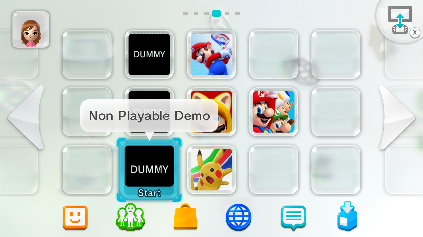

# Adding and removing demos

Hub: [README.md](README.md) · [SYSNAND.md](SYSNAND.md) · [PROBLEMS.md](PROBLEMS.md)

Every playable kiosk demo needs three pieces on the console:

| # | What | FTP path |
|---|------|----------|
| 1 | Ticket (`.tik`) | `storage_slc/sys/rights/ticket/…` |
| 2 | Title ID in **`title.list`** | `storage_slc/sys/rights/sys/title.list` |
| 3 | Title files | `storage_mlc/usr/title/00050002/<8-char-id>/` |

**MLC folders are always your job** (WinSCP / FTP). Folder name on the console must be **only** the 8-character ID (`10117e00`), not `10117e00 - Super Mario U` or `0005000210117e00`.

---

## Adding demos

1. Map dump folders → ticket paths (PC): [`map_kiosk_demo_tickets.ps1`](../../scripts/map_kiosk_demo_tickets.ps1)  
   Looks in `dumps\kiosk\Extracted\usr\title\00050002` by default.  
   Output: `backup\live_slc_pre_mutant\kiosk_demo_ticket_map.txt` (`playable` vs `stub`).
2. Upload the playable MLC folder (and stub sibling if the map has one).
3. Patch SLC rights from the PC extract folder (suffix in the name is fine):

```powershell
.\scripts\patch_demo_rights_ftp.ps1 -Mode Add -DemoFolder 'C:\path\to\10117e00 - Super Mario U'
```

Bulk path: `build_mutant_slc.ps1 -Rebuild` then `plan_additive_tickets.ps1` / `apply_mutant_slc_ftp.ps1`.

If Home plays a demo but Kiosk Menu does not: [PROBLEMS.md — title.list](PROBLEMS.md#demos-launch-on-home-menu-but-not-from-kiosk-menu).

---

## Stubs

`stub` rows (`…FF`, `non_playable_demo.rpx`, or `KioskMeta.xml` pointing at another title) are **video tiles for Kiosk Menu**. Do **not** open them from Home or SCT. Copy stub MLC + ticket when pairing with a playable demo. Some titles are playable-only (e.g. New Super Mario Bros. U).

On Home they often show as **DUMMY** / **Non Playable Demo** — leave them alone; launch the playable sibling instead:



---

## Different-region demos

**Another region (e.g. USA demos on a PAL console):** FTP the demo onto MLC as above, run `patch_demo_rights_ftp.ps1 -Mode Add` with your extract folder, then in Kiosk Menu set **Region** to match. Labels are typically **North/Latin America**, **Japan**, **Europe/Australia/NZ** (wording can differ by kiosk version). Switching Region **hides** the other set; it does **not** delete them. Full write-up: [PROBLEMS.md — Region](PROBLEMS.md#region-and-adding-demos-from-another-region).

---

## Removing demos

1. Delete the MLC folder over FTP (`storage_mlc/usr/title/00050002/<8-char-id>/`).
2. Remove the ticket and `title.list` entry:

```powershell
.\scripts\patch_demo_rights_ftp.ps1 -Mode Remove -DemoFolder 'C:\path\to\10117e00 - Super Mario U'
```

Reboot after removing demo files. You can delete MLC by hand; the script only clears tickets and `title.list` entries.
