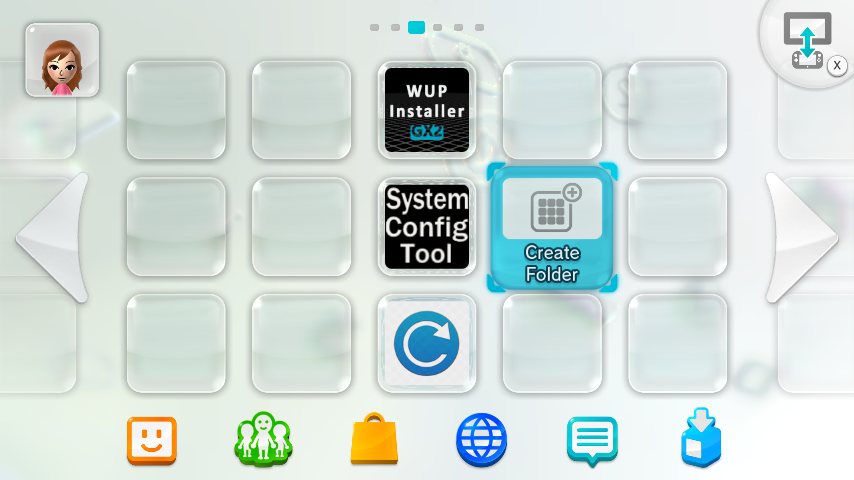

# Retail Wii U Kiosk Menu

Tools to run **Kiosk Menu** on a retail Wii U. **No dumps or tickets** in this repo.

**Risk:** bad writes can soft-brick. Back up SD + NAND first. **PAL** tested; **USA** in scripts; **JPN** not supported yet.

Read this page before starting, or skip it if you know what you are doing.

## Kiosk Menu, not "kiosk OS"

It's likely that kiosks ran the **retail Wii U system**. **Kiosk Menu** is an app (`1fa81000`) opened from **SCT**, plus extra SLC tickets and demo titles on MLC. This project does **not** replace the OS with kiosk firmware.

Working titles: **Kiosk Menu**, **Some Kiosk Apps**, **native SCT**, launch tickets, and optional **demos**. Porting other kiosk system apps (HOME overlay, error UI, browser, …) is **not** part of the main guide — same title ID as retail is **not** a drop-in swap and can hard-brick with **160-0103**. An incomplete, high-risk HOME/fonts path lives under **[EXPERIMENTAL.MD](EXPERIMENTAL.MD)**.

Keep **retail Home Menu** as default boot so FTP still works. See [Default boot](#default-boot-optional).

This is what the menu looks like:

  
  

Some Aroma plugins **may** also work while Kiosk Menu is open (these shots were taken that way). That is **not** guaranteed for every plugin or every setup — do **not** count on FTP or overlays inside Kiosk Menu for recovery. Prefer **Home Menu** for FTPiiU.

---

## Ready to start?

| Path | Guide |
|------|--------|
| **Real hardware** (sysNAND) | **[SYSNAND.md](SYSNAND.md)** |
| **Problems, bugs, undo** | **[PROBLEMS.md](PROBLEMS.md)** |
| **Adding / removing demos** | **[NEWDEMOS.md](NEWDEMOS.MD)** |
| **Kiosk system titles** (Featured, New, attract) | **[KIOSKTITLESDOC.MD](../KIOSKTITLESDOC.MD)** |
| **Japan / NCL Kiosk Menu** | **[JPNKIOSKMENU.MD](JPNKIOSKMENU.MD)** |
| **Experimental** (kiosk HOME / fonts) | **[EXPERIMENTAL.MD](EXPERIMENTAL.MD)** |
| **Screenshots** (minute / SCT / kiosk) | **[PROBLEMS.md § Screenshots](PROBLEMS.md#screenshots)** · [SCT menu map](../PNG/HowSystemConfigLooksLike.MD) · [Kiosk Settings map](../PNG/HowKioskSettingsLookLike.MD) |

Launch: **Home → System Config Tool (SCT) → Kiosk Menu**.

---

## System Config Tool

You need **one** SCT on MLC to open Kiosk Menu (unless coldboot is Kiosk Menu):

| SCT | Title ID | How |
|-----|----------|-----|
| **Native (kiosk)** | `1f700500` | Default — [`upload_sys_title_mlc.ps1`](../../scripts/upload_sys_title_mlc.ps1) |
| **Retail / homebrew** | `13374454` | WUP Installer GX |

Retail SCT on Home Menu looks like this:

**If retail SCT is not on Home Menu:** either install **retail/homebrew** `13374454` with WUP Installer GX, **or** set coldboot to **native SCT** (`.\scripts\swap_coldboot_ftp.ps1 -Mode sct`) so you land in `1f700500` every boot. Native SCT is for the Title Launcher path below; it does not appear as a normal Home icon like retail SCT.

**Launch Kiosk Menu from SCT:**

1. Open System Config Tool  
2. **Title Launcher** → **System NAND memory (mlc)**  
3. Find **Kiosk Menu** → press **A**  
4. Confirm **Title Type: Menu** before launching  

Do **not** use SCT **Boot title** to make Kiosk Menu the default (brick risk). Use [`swap_coldboot_ftp.ps1`](../../scripts/swap_coldboot_ftp.ps1) only after Home → SCT → Kiosk Menu works.

Full SCT menu map (every screen, what `<options>` mean): [HowSystemConfigLooksLike.MD](../PNG/HowSystemConfigLooksLike.MD).

---

## Default boot (optional)

After **Home → SCT → Kiosk Menu** works, you may change power-on boot (`storage_slc/sys/config/system.xml`). Run [`build_mutant_slc.ps1`](../../scripts/build_mutant_slc.ps1) first.

| # | Boots into | Command |
|---|------------|---------|
| **1** | **Retail Home Menu** (recommended) | `.\scripts\swap_coldboot_ftp.ps1 -Mode home` |
| **2** | Native SCT | `.\scripts\swap_coldboot_ftp.ps1 -Mode sct` |
| **3** | Kiosk Menu | `.\scripts\swap_coldboot_ftp.ps1 -Mode kioskmenu` |

Option 3: Home never loads → **FTP never starts** → PC undo will not work. Recovery = reflash SLC. Details: [PROBLEMS.md — coldboot trap](PROBLEMS.md#stuck-in-kiosk-menu-coldboot).

---

## Scripts

| Script | Role |
|--------|------|
| [`setup_config.ps1`](../../scripts/setup_config.ps1) | IP + SD letter + region |
| [`build_mutant_slc.ps1`](../../scripts/build_mutant_slc.ps1) | Merge retail + kiosk licenses on PC |
| [`backup_slc_ftp.ps1`](../../scripts/backup_slc_ftp.ps1) / [`plan_additive_tickets.ps1`](../../scripts/plan_additive_tickets.ps1) / [`apply_mutant_slc_ftp.ps1`](../../scripts/apply_mutant_slc_ftp.ps1) | Live SLC patch (`system.xml` default **N**; always overwrites Kiosk Menu / SCT tickets) |
| [`map_kiosk_demo_tickets.ps1`](../../scripts/map_kiosk_demo_tickets.ps1) | Demo folder → `.tik` map (PC) |
| [`patch_demo_rights_ftp.ps1`](../../scripts/patch_demo_rights_ftp.ps1) | Add/remove demo `title.list` + `.tik` |
| [`upload_sys_title_mlc.ps1`](../../scripts/upload_sys_title_mlc.ps1) | Kiosk Menu + native SCT → MLC |
| [`force_kiosk_launch_tickets_ftp.ps1`](../../scripts/force_kiosk_launch_tickets_ftp.ps1) | Retry Kiosk Menu + native SCT tickets (if *Cannot launch* after an older apply) |
| [`swap_coldboot_ftp.ps1`](../../scripts/swap_coldboot_ftp.ps1) | `-Mode home` / `sct` / `kioskmenu` |
| [`restore_im_cfg_ftp.ps1`](../../scripts/restore_im_cfg_ftp.ps1) | Idle reboot fix |
| [`set_sys_prod_region_ftp.ps1`](../../scripts/set_sys_prod_region_ftp.ps1) | Optional region spoof |
| [`apply_kiosk_hbm_ftp.ps1`](../../scripts/apply_kiosk_hbm_ftp.ps1) / [`apply_kiosk_fonts_ftp.ps1`](../../scripts/apply_kiosk_fonts_ftp.ps1) | **Experimental** — [EXPERIMENTAL.MD](EXPERIMENTAL.MD) |

Mutant output: `overlay\mutant\slc\` ([overlay/README.md](../../overlay/README.md)).

Something broken? **[PROBLEMS.md](PROBLEMS.md)** — launch tickets, idle reboot, reverse/undo.

---

## Legal

Kiosk NAND/title/SCT data is copyrighted. You obtain dumps yourself.

- [ISFShax](https://isfsh.ax/) · [How to set up ISFShax](https://gbatemp.net/threads/how-to-set-up-isfshax.642258/)
- [wiiu-nandextract](https://github.com/koolkdev/wiiu-nandextract) · [wfs-tools](https://github.com/koolkdev/wfs-tools)

Thanks: [koolkdev](https://github.com/koolkdev), ISFShax / minute community, and Cursor AI ([cursor.com](https://cursor.com/)).
