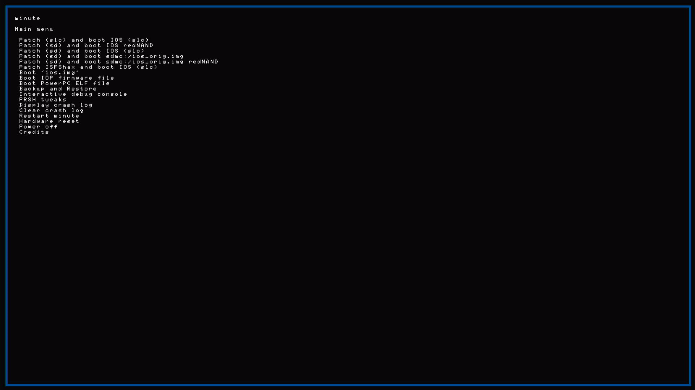
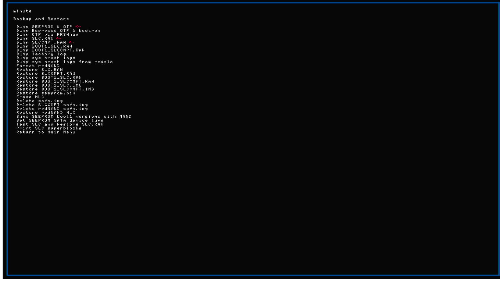
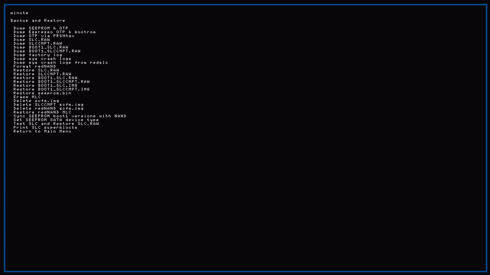
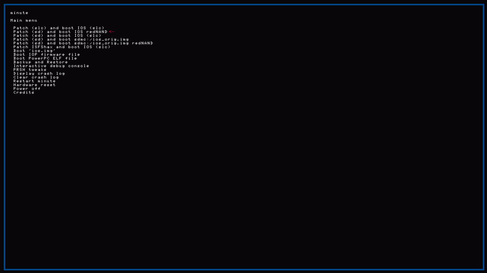
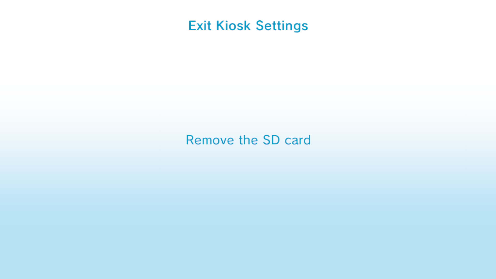

# redNAND path

You found the secret redNAND version. Why isn't it in the main documentation? Because it's **useless** for day-to-day kiosk on redNAND: Exit Kiosk Settings can ask you to [remove the SD card](#exit-kiosk-settings-remove-the-sd-card), and on redNAND that card holds your licenses.

Licenses on the **SD** (redSLC). Kiosk Menu on **sys MLC** (Hybrid) or **red MLC** (Full). **Keep the SD inserted** while Kiosk Menu / settings run — pulling the card crashes or drops the mutant licenses on redSLC.

**Warning:** Exit Kiosk Settings can show **Remove the SD card** before the show menu. On redNAND that is unsafe — see [below](#exit-kiosk-settings-remove-the-sd-card).

**Hybrid note:** redSLC lives on the SD; your retail games stay on **internal sys MLC**. Some kiosk settings flows assume a full kiosk NAND layout — if you need Kiosk Menu without the SD-in/out quirks of redNAND, prove the mutant here first, then move to [SYSNAND.md](SYSNAND.md).

**SysNAND / no SD lab?** → [SYSNAND.md](SYSNAND.md)

---

## Before you start

1. ISFShax + minute working; Aroma OK for FTP

   

2. SD card — minute **Backup and Restore** → **Format redNAND** (backs up the card first):

   

   - **Hybrid:** **32 GB+** is usually enough (redSLC + minute FAT; sys MLC stays on console)
   - **FullRedNand:** **64 GB+** recommended (red SLC **and** red MLC on SD — size depends on your MLC dump)
3. Retail + kiosk dumps extracted on PC:
   - **SLC** with [NAND Extractor](https://github.com/koolkdev/wiiu-nandextract) + **otp.bin** → `dumps\retail\` and `dumps\kiosk\` (see the text file in each folder)
   - **Kiosk MLC** with [wfs-extract](https://github.com/koolkdev/wfs-tools): `--dump-path Extracted` inside `dumps\kiosk`, **or** set `KioskMlcSysTitleRoot` to your extract
4. `.\scripts\setup_config.ps1` — Region, **your** Wii U IP, **your** SD drive letter (from This PC — the volume with `\minute\`). Scripts resolve the disk number from that letter; they never guess `E:` or auto-pick a USB stick.
5. Set **`DeploymentMode`** in config:
   - **`Hybrid`** (default) — redSLC on SD + **sys** MLC (your games stay on console)
   - **`FullRedNand`** — SLC + MLC on SD (isolated kiosk world; retail sys MLC not copied in)

Windows shows a FAT drive (whatever letter Windows assigned, with `\minute\`) plus hidden ~512 MB partitions. Flash scripts need **Administrator** PowerShell and ask **Y/N** before writing.

Shared concepts (SCT, coldboot, demos): [README](README.md). Problems / undo (sysNAND-oriented): [PROBLEMS.md](PROBLEMS.md). Demos: [NEWDEMOS.MD](NEWDEMOS.MD).

---

## 1. Format SD → flash redSLC

### Dump

In minute → **Backup and Restore**, dump at least **SEEPROM & OTP**, **SLC.RAW**, and **SLCCMPT.RAW** (store offline):



Full Backup and Restore list (Format redNAND, Restore, Erase MLC, …):



### Strip + validate (PC)

```powershell
.\scripts\strip_from_config.ps1 -Kind slc
.\scripts\validate_slc_dump.ps1 -UseConfig
```

Do **not** flash if validation fails.

### Flash (Admin PowerShell, SD in PC)

```powershell
.\scripts\flash_stripped_partition.ps1 -UseConfig -Partition slc
```

This writes the stripped image to the **SD SLC partition** only — internal sys SLC is untouched on Hybrid.

**FullRedNand:** you also need a red MLC partition flashed from your dump (minute Format redNAND creates it). See the [redNAND guide](https://gbatemp.net/threads/how-to-setup-rednand-to-fix-system-memory-error-160-0103-failing-emmc-without-soldering.642268/) if MLC setup is not done yet.

Boot once with the SD inserted to confirm the console still starts.

---

## 2. Build mutant on PC

```powershell
.\scripts\build_mutant_slc.ps1
```

Output: `overlay\mutant\slc\` — merged certs/tickets, **WIS-001** / **FW** identity (region/serial stay retail). Build includes merged `system.xml`; apply asks **Y/N** before uploading it (**default N**).

---

## 3. Install rednand.ini + reboot

```powershell
.\scripts\install_rednand_ini.ps1
```

| Mode | `rednand.ini` effect |
|------|----------------------|
| Hybrid | `rednand.hybrid.ini` — `mlc=false` (sys MLC) |
| FullRedNand | `rednand.full.ini` — `mlc=true` (red MLC on SD) |

Boot with minute: **Patch (sd) and boot IOS redNAND**. Wait for Home Menu, then enable FTP if needed:



Reboot with the redNAND SD **inserted** so FTP `storage_slc` / `storage_mlc` match your `DeploymentMode`.

### If redNAND does not boot

**Hybrid**

- SD **inserted** and SLC partition **flashed** (step 1)
- `rednand.ini` present under `\minute\` on the FAT volume
- Re-flash redSLC from a fresh SLC.RAW → strip → validate if the partition is corrupt
- Boot minute: **Patch (SD)** → **boot IOS (redNAND)**

**FullRedNand**

- SD **inserted**; **both** SLC and MLC partitions flashed
- Re-flash redSLC and/or red MLC from offline dumps if either partition is bad
- You need a bootable Wii U OS on red MLC — if MLC is empty or corrupt, create/flash red MLC per the [redNAND guide](https://gbatemp.net/threads/how-to-setup-rednand-to-fix-system-memory-error-160-0103-failing-emmc-without-soldering.642268/)
- Boot minute: **Patch (SD)** → **boot IOS (redNAND)**

---

## 4. FTP → patch redSLC

Wii U on, Home Menu up, FTP plugin running, same Wi‑Fi as PC. Each script asks **Y/N** before touching `storage_slc` (uses **`config\config.ps1`** for Wii U IP).

```powershell
.\scripts\backup_slc_ftp.ps1
.\scripts\plan_additive_tickets.ps1
.\scripts\apply_mutant_slc_ftp.ps1
```

Default apply uploads **rights + identity** (cert, title.list, sys_prod, tickets). You are then asked **Y/N** to upload **system.xml** — **default N** (could cause instability; Kiosk Menu works without it). **`-ApplySystemXml`** uploads without asking. **`-FullKioskPolicy`** also uploads eco/prefs.

When asked about Kiosk Menu as default boot → **N**. Once trapped, Home never loads → **FTP plugins never start**. Undo: re-flash a **clean retail** redSLC on the SD ([step 1](#1-format-sd--flash-redslc)), or see [PROBLEMS.md — coldboot](PROBLEMS.md#stuck-in-kiosk-menu-coldboot) for the sysNAND case.

Quick check: `cert.sys` under `storage_slc/sys/rights/sys/` should be ~6656 bytes.

If SCT/Kiosk Menu say *Cannot launch this title* after apply, run `.\scripts\force_kiosk_launch_tickets_ftp.ps1` — [PROBLEMS.md](PROBLEMS.md#cannot-launch-this-title-sct-or-kiosk-menu).

---

## 5. Add Kiosk Menu + SCT

Upload only titles that extracted **cleanly**.

```powershell
.\scripts\upload_sys_title_mlc.ps1
```

Confirm the log shows `code/`, `content/`, `meta/` — not `ode/` / `ontent/` / `eta/`. Wrong folders will not launch; see [PROBLEMS.md — MLC path upload](PROBLEMS.md#mlc-upload-shows-ode--ontent--eta).

**System Config Tool (required):** Kiosk Menu is opened from SCT unless coldboot is Kiosk Menu ([README — Default boot](README.md#default-boot-optional)). You need **one** SCT on MLC:

| SCT | Title ID | Install |
|-----|----------|---------|
| **Native (kiosk)** | `1f700500` | Default — uploaded by script above |
| **Retail / homebrew** | `13374454` | WUP Installer GX if native SCT is missing from your dump |

If you use coldboot **option 2** (`swap_coldboot_ftp.ps1 -Mode sct`), native SCT (`1f700500`) must be on MLC — retail SCT is for the Home → SCT → Kiosk Menu path, not the kiosk `system.xml.kioskboot` coldboot target.

**Launch:** Home → **SCT** → Kiosk Menu.

In SCT: **Title Launcher** → **System NAND memory (mlc)** → **Kiosk Menu** → **A** → confirm **Title Type: Menu** before launch. If you have no retail SCT on Home, install `13374454` via WUP Installer GX or coldboot native SCT (`swap_coldboot_ftp.ps1 -Mode sct`). Details: [README — SCT](README.md#system-config-tool).

More demos: [NEWDEMOS.MD](NEWDEMOS.MD). Launch / grid issues: [PROBLEMS.md](PROBLEMS.md).

**After first Kiosk Menu use:** idle reboot on Home (~2 min) is common. In **Kiosk Settings**, set **No-Input Reset → Off**. If it still reboots when idle: `.\scripts\restore_im_cfg_ftp.ps1` — [PROBLEMS.md — Idle reboot](PROBLEMS.md#idle-reboot-after-kiosk-menu--demos).

Menu map: [HowKioskSettingsLookLike.MD](../PNG/HowKioskSettingsLookLike.MD).

---

## Exit Kiosk Settings: Remove the SD card

On **Exit Kiosk Settings**, if an SD card is inserted, Kiosk Menu shows **Remove the SD card** before the carousel / **Kiosk Show** path:



On **redNAND**, licenses live on the **SD** (redSLC). Pulling the card while the console is running is like yanking the system drive out of a PC — expect a crash, freeze, or a dead mutant until you reboot with the card back in.

| Path | What to do |
|------|------------|
| **redNAND (Hybrid / Full)** | **Do not** remove the SD to “continue.” Stay in settings only as needed (**No-Input Reset → Off**, Region, …), then leave via Home / reboot **with the SD still in**. Use Home → SCT → Kiosk Menu for day-to-day launch. |
| **sysNAND** | After a good apply the SD is optional — see [SYSNAND.md](SYSNAND.md) and [PROBLEMS.md](PROBLEMS.md#exit-kiosk-settings-remove-the-sd-card). |

Prefer [SYSNAND.md](SYSNAND.md) if you need kiosk without living on an SD.

---

## You made it

If you reach **Kiosk Settings** after Home → SCT → Kiosk Menu, the mutant + MLC path worked:


Remember: on redNAND, **do not** pull the SD when Exit asks — [above](#exit-kiosk-settings-remove-the-sd-card).

---

## Idle reboots / recovery

| Problem | redNAND recovery |
|---------|------------------|
| Bad / experimental SLC | Fresh SLC.RAW → strip → validate → flash SD partition → re-apply mutant |
| Pull SD while kiosk runs / Exit asks to remove SD | [SD remove trap](#exit-kiosk-settings-remove-the-sd-card) — keep card in |
| Broken sys title on MLC | Delete/replace the uploaded folder ([MLC paths](PROBLEMS.md#mlc-upload-shows-ode--ontent--eta)) |
| Coldboot trap (Kiosk Menu default) | Re-flash **clean retail** redSLC ([step 1](#1-format-sd--flash-redslc)) |
| Full undo | Flash clean retail stripped SLC **without** re-applying mutant; delete uploaded kiosk titles from MLC if you want |

Idle reboot, *Cannot launch*, demo grid (sysNAND-oriented wording): **[PROBLEMS.md](PROBLEMS.md)**.

Minute screenshots: [Boot redNAND](../PNG/Minute/HowToBootRedNAND.png) · [Format redNAND](../PNG/Minute/HowToFormatRedNANDSD.png) · [Backup and Restore](../PNG/Minute/DumpAndRestore.png).
