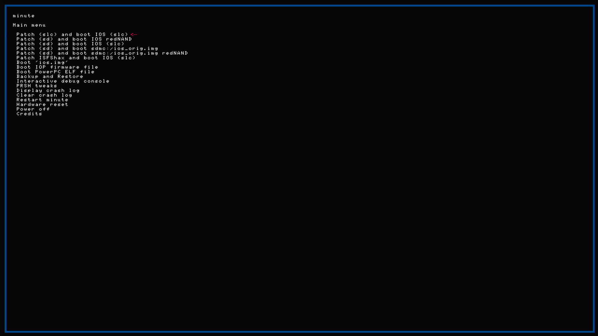
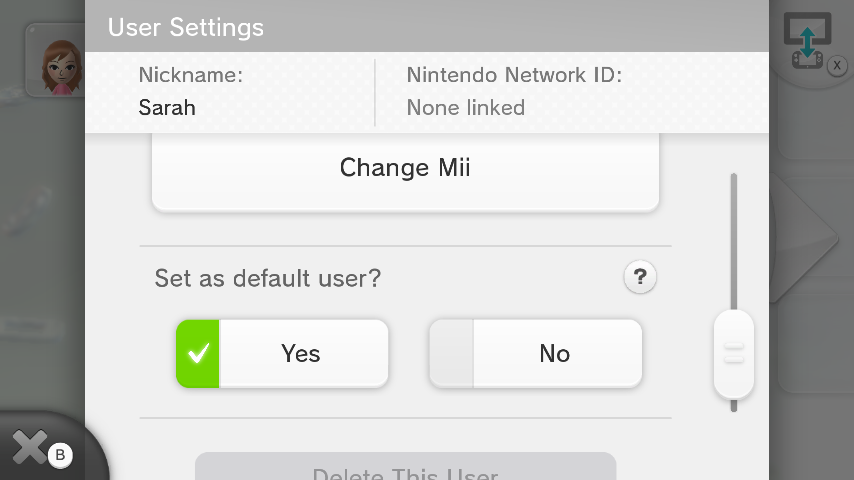

# Real hardware (sysNAND) path

Mutant licenses + Kiosk Menu on the **console’s own SLC and MLC**. After apply, the **SD is optional** for day-to-day kiosk use.

---

## Warnings

Writes to the Wii U / SD ask **Y/N** (default **N**), log under `logs\`, pause on error. `-Force` skips confirms.
FTP always writes to whatever is mounted as `storage_slc` / `storage_mlc`. For this path that must be **real** internal NAND.
**Back up all user saves** (kiosk will create user **Sarah** as the main user).

---

## Before you start

- **ISFShax + minute** ([setup](https://gbatemp.net/threads/how-to-set-up-isfshax.642258/)) — Aroma alone is not enough (FTP apps still fine)
- **Windows 10/11** + PowerShell 5.1+
- **curl.exe** on PATH (scripts call `curl.exe`, not the PowerShell alias)
- Retail **and** kiosk dumps, extracted yourself:
  - **SLC:** [NAND Extractor](https://github.com/koolkdev/wiiu-nandextract) — needs **otp.bin** from that NAND. Put the trees in `dumps\retail\` and `dumps\kiosk\` (read the text file in each folder).
  - **Kiosk MLC** (Kiosk Menu / SCT / demos): [wfs-extract](https://github.com/koolkdev/wfs-tools). Default: `dumps\kiosk\Extracted\`. Or set `KioskMlcSysTitleRoot` to wherever you extracted.
- FTP to the Wii U while **Home Menu** is up
- Fresh minute SLC backup before touching internal NAND ([What to dump before sysNAND work](../PNG/Minute/WhatNeedsToBeDumpedOnYourConsole.png))

---

## Settings

```powershell
cd RetailWiiUKioskMenu
.\scripts\setup_config.ps1
```

Wizard: region, `DeploymentMode`, Wii U IP, SD letter (volume with `\minute\`). Dump paths default to `dumps\retail` and `dumps\kiosk`. Or copy `config\config.example.ps1` → `config\config.ps1`. Scripts **refuse** the example file automatically.

Set **`DeploymentMode = 'SysNand'`** in `config\config.ps1`.

---

## 1. Boot so FTP hits sysNAND

Boot with minute: **Patch (slc) and boot IOS (slc)**:



Wait until Home Menu is up and turn on FTP (FTPiiU or your plugin).

Confirm FTP mounts **internal** `storage_slc` / `storage_mlc` before continuing. Scripts use **Critical** Y/N confirms for sysNAND writes.

### If Patch (slc) and boot IOS (slc) fails

That usually means **minute / ISFShax plugins are not on SLC** (`hax` was never copied, or was wiped). Until `hax` is on SLC, you can still boot with **Patch (sd) and boot IOS (slc)** (plugins from the SD):


Then copy `hax` to SLC with **haxcopy** ([ISFShax setup guide](https://gbatemp.net/threads/how-to-set-up-isfshax.642258/)):

1. If you downloaded from [isfsh.ax](https://isfsh.ax/) or used their download script, the files are already under a `hax` folder — you can skip steps 2–6 and go to **haxcopy**. That download uses **fastboot** minute (see the ISFShax thread).
2. Otherwise create a folder **`hax`** on the SD card (this is what gets copied to SLC).
3. Copy **`fw.img`** into `hax\`.
4. Create **`hax\ios_plugins\`**.
5. Copy **`00core.ipx`** and **`5isfshax.ipx`** into `hax\ios_plugins\`.
6. Optional: for coldboot Aroma/Tiramisu, also copy **`5payldr.ipx`**. Any other plugins (e.g. `wafel_unlimit.ipx`) go in the same folder with the names the guide expects.
7. Install the **haxcopy** app under `wiiu\apps\` like any other homebrew.
8. Put the SD in the Wii U, boot to Home, run **haxcopy** to copy the `hax` folder to SLC.
9. Reboot into minute and try **Patch (slc) and boot IOS (slc)** again.

Full detail and updates: [How to set up ISFShax](https://gbatemp.net/threads/how-to-set-up-isfshax.642258/).

---

## 2. Build mutant on PC

Use this script to build the mutant SLC overlay on PC — retail base plus kiosk certs/tickets so the console can launch Kiosk Menu titles:

```powershell
.\scripts\build_mutant_slc.ps1
```

Retail base + kiosk certs/tickets, **WIS-001** / **FW** identity (serial/region kept retail). Build includes a merged `system.xml`; apply asks **Y/N** before uploading it (**default N**).

---

## 3. FTP → patch sys SLC

```powershell
.\scripts\backup_slc_ftp.ps1
.\scripts\plan_additive_tickets.ps1
.\scripts\apply_mutant_slc_ftp.ps1
```

By default apply uploads **cert.sys**, **title.list**, **sys_prod.xml**, and additive tickets. It then prompts to upload **system.xml** (kiosk crash/standby policy) — answer **N** (default). Kiosk Menu works without it via Home → SCT. **`-ApplySystemXml`** skips the prompt and uploads. **`-FullKioskPolicy`** also uploads eco/prefs.

Default boot prompt → **N**. Kiosk Menu coldboot on **sys** SLC traps you (no Home, no FTP). Recovery: [PROBLEMS.md](PROBLEMS.md#stuck-in-kiosk-menu-coldboot).

A mistake here hits **internal** SLC. Same recovery: minute restore from your offline dump.

If SCT/Kiosk Menu say *Cannot launch this title*, run `.\scripts\force_kiosk_launch_tickets_ftp.ps1` — [PROBLEMS.md](PROBLEMS.md#cannot-launch-this-title-sct-or-kiosk-menu).

---

## 4. Add Kiosk Menu + SCT on sys MLC

```powershell
.\scripts\upload_sys_title_mlc.ps1
```

Confirm the log shows remote paths under `code/`, `content/`, and `meta/` — not truncated names like `ode/` / `ontent/` / `eta/`. If you ever see those, stop and re-run after updating the script; wrong folders will not launch. See [PROBLEMS.md — MLC path upload](PROBLEMS.md#mlc-upload-shows-ode--ontent--eta).

**System Config Tool (required):** Kiosk Menu is opened from SCT. You need **one** on MLC:

- **Native SCT** `1f700500` — uploaded by the script above (default)
- **Retail / homebrew SCT** `13374454` — install with WUP Installer GX if native SCT is missing from your kiosk dump

**Launch:** Home → **SCT** → Kiosk Menu (unless you change coldboot — [README — Default boot](README.md#default-boot-optional)).

In SCT: **Title Launcher** → **System NAND memory (mlc)** → **Kiosk Menu** → **A** → confirm **Title Type: Menu** before launch. No retail SCT on Home? Install `13374454` via WUP Installer GX, or coldboot native SCT (`swap_coldboot_ftp.ps1 -Mode sct`). See [README — SCT](README.md#system-config-tool).

More demos: [NEWDEMOS.MD](NEWDEMOS.MD). Launch / idle / undo: [PROBLEMS.md](PROBLEMS.md).

**After first Kiosk Menu use:** idle reboot on Home (~2 min) is common. In **Kiosk Settings**, set **No-Input Reset → Off**. If it still reboots when idle: `.\scripts\restore_im_cfg_ftp.ps1` — [PROBLEMS.md — Idle reboot](PROBLEMS.md#idle-reboot-after-kiosk-menu--demos).

After a good apply, you can remove the SD for normal kiosk use (keep a card if you still want Aroma/homebrew). Exit Kiosk Settings → **Remove the SD card** is fine on sysNAND — [PROBLEMS.md](PROBLEMS.md#exit-kiosk-settings-remove-the-sd-card).

Menu map: [HowKioskSettingsLookLike.MD](../PNG/HowKioskSettingsLookLike.MD).

---

## Hard rules

- **SCT on MLC** before launching Kiosk Menu from Home
- **Home Menu** coldboot unless you accept the Kiosk Menu trap
- **Do not** launch stub / `…ff` / `non_playable_demo.rpx` titles from Home or SCT ([stubs](NEWDEMOS.MD#stubs))
- Back up **saves and Miis** before first kiosk launch — Kiosk Menu will create user **Sarah** and replace the current account. A new account you add later is left alone. Details: [PROBLEMS.md](PROBLEMS.md#how-to-reverse-this)

  
- Mutant identity **WIS-001** / **FW** — do **not** [WiiUIdent](https://github.com/GaryOderNichts/WiiUIdent) **Submit System Data**
- Upload only **clean** MLC extracts. In SCT, avoid **Boot title**

---

## You made it

If you reach **Kiosk Settings** after Home → SCT → Kiosk Menu, the mutant + MLC path worked:


