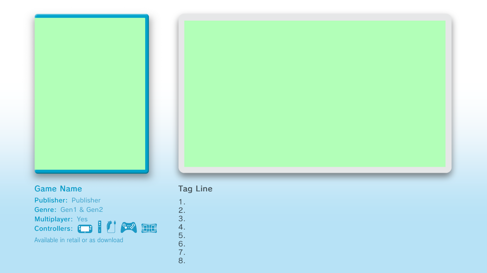

# How to make a custom kiosk demo (video stub)

Rough guide: turn a **video-only** stub title into your own trailer tile in Kiosk Menu.

You keep the stub’s **title ID + ticket**. You only replace the movie, text, and art.

For swapping the **playable game** RPX (homebrew via **Play Demo**), see [HOWTOMAKECUSTOMGAMEDEMO.MD](HOWTOMAKECUSTOMGAMEDEMO.MD).

## Needed

* [ffmpeg](https://ffmpeg.org/download.html) for video.
* [GTX Extractor](https://github.com/aboood40091/GTX-Extractor/releases/tag/v5.3) (for box art).
* A **video stub** you don’t mind overwriting  
  (folder with `non_playable_demo.rpx`, `meta/KioskMovie.mp4`, `meta/KioskMeta.xml`).

---

## 1. Video (`meta/KioskMovie.mp4`)

Encode like Nintendo’s kiosk trailers: **1080p H.264 High@L4.0 + AAC stereo 48 kHz** (not Opus).

```powershell
ffmpeg -y -i "YourSource.mp4" `
  -map 0:v:0 -map 0:a:0? `
  -c:v libx264 -profile:v high -level 4.0 -pix_fmt yuv420p `
  -x264-params "cabac=1:ref=4:deblock=1:0:0:me=hex:subme=7" `
  -vf "scale=1920:1080:force_original_aspect_ratio=decrease,pad=1920:1080:(ow-iw)/2:(oh-ih)/2" `
  -r 30 `
  -c:a aac -b:a 192k -ac 2 -ar 48000 `
  -movflags +faststart `
  -brand mp42 `
  "KioskMovie.mp4"
```

Put the result at `meta/KioskMovie.mp4` (overwrite the old one; keep a backup).

---

## 2. Text (`meta/KioskMeta.xml`)

This file is the catalog card Kiosk Menu reads (title, publisher, genre line, blurb, etc.).

Prefer to edit your own `.xml` instead of copy-and-paste from here. This shows how things function.

Where each field shows up on the TV (template labels):



### How the language blocks work

Kiosk Menu shows different languages. Each **text field** is repeated once per language inside a `LanguageCell`.

Think of it as:

> “For English, show this string. For French, show that string.”

Pattern (same for every text field):

```xml
<SomeFieldName>
  <LanguageCell Language="US_English">
    <Text>What English users see</Text>
  </LanguageCell>
  <LanguageCell Language="US_French">
    <Text>What French users see</Text>
  </LanguageCell>
</SomeFieldName>
```

* `Language="…"` = which language this line is for  
* `<Text>…</Text>` = the actual words on screen  
* You can use **one** `<Text>` or **several** (each is roughly one line)

For a USA-focused stub, edit **`US_English`** and leave the other `LanguageCell`s alone. Don’t delete French/Spanish/Portuguese blocks — if the kiosk language isn’t English, those slots can go blank.

Common language ids you’ll see: `US_English`, `US_French`, `US_Spanish`, `US_Portuguese`.

### Fields you usually edit

| Block | What it is on screen |
|-------|----------------------|
| `demoTitle` | Game / trailer name |
| `demoPublisher` | Publisher under the title (e.g. Nintendo) |
| `genreDisp` | Genre line (e.g. `Action & Adventure`) |
| `tagLine` | Short line under the video |
| `description` | Longer info text (several `<Text>` lines) — see limits below |

Also check near the top of the file (not language blocks):

| Tag | Meaning |
|-----|---------|
| `MinPlayers` / `MaxPlayers` | Player count. Also drives **Multiplayer** on the card (`Yes` when Max is greater than 1, otherwise `No`) |
| `controllerGame` | Controllers listed (repeat the tag per controller / per remote slot) |
| `distType` | Availability line under the controllers. USA stubs usually use `2` → “Available in retail or as download” |

Known controller values: `DRC`, `Nunchuck`, `Wii_Remote`, `Classic`, `Balance_Board`, `URCC` (Pro), `Other`.

### Description limits

* **Max ~87 characters per `<Text>` line** — longer lines clip off the right edge.
* **Use at most 8 `<Text>` rows** in `description`. Nine can physically fit but sits too low and is risky; stick to **8**.

### Example (English only)

Template-style English blocks (same idea as a filled stub). In a real file, change only the `US_English` cells; leave the other languages as they are.

```xml
<demoTitle>
  <LanguageCell Language="US_English">
    <Text>Game Name</Text>
    <Text></Text>
  </LanguageCell>
</demoTitle>

<demoPublisher>
  <LanguageCell Language="US_English">
    <Text>Publisher</Text>
  </LanguageCell>
</demoPublisher>

<genreDisp>
  <LanguageCell Language="US_English">
    <Text>Gen1 &amp; Gen2</Text>
  </LanguageCell>
</genreDisp>

<tagLine>
  <LanguageCell Language="US_English">
    <Text>Tag Line</Text>
    <Text></Text>
  </LanguageCell>
</tagLine>

<description>
  <LanguageCell Language="US_English">
    <Text>1.</Text>
    <Text>2.</Text>
    <Text>3.</Text>
    <Text>4.</Text>
    <Text>5.</Text>
    <Text>6.</Text>
    <Text>7.</Text>
    <Text>8.</Text>
  </LanguageCell>
</description>
```

XML tip: write `&` as `&amp;` inside text (see `Gen1 &amp; Gen2` above).

Do **not** change `titleID` in this file unless you also change the folder name and have a matching ticket for that ID. For a reskin, leave the ID alone.

---

## 3. Pictures (box art `.gtx`)

1. Drag a `.gtx` (e.g. `meta/KioskBoxArt_ESRB.gtx`) onto `gtx_extract.exe` → you get a `.dds`  
2. Edit the `.dds` in an image tool that supports DDS  
3. Drag the edited `.dds` back onto `gtx_extract.exe` → new `.gtx`  
4. Replace the old `.gtx` in `meta/`

---

## 4. Install on the Wii U

Treat it like any other demo: same title ID folder, ticket, and `title.list`.

See:

* Human: [ADDINGGAMES.MD](HUMAN/ADDINGGAMES.MD)  
* Scripts: [NEWDEMOS.MD](AI/NEWDEMOS.MD)

Example:


Game made by [siahisaforker](https://github.com/PortPak/sonic3air-plus).

# AI usage

Cursor was used to check spelling and fix a few in my text bugs. Mostly human documentation on how to add pictures and replace text.

Cursor helped understand and recreate the right `.mp4` with ffmpeg since the Wii U won't accept modern versions.

Cursor also helped explain `.xml` for new users.