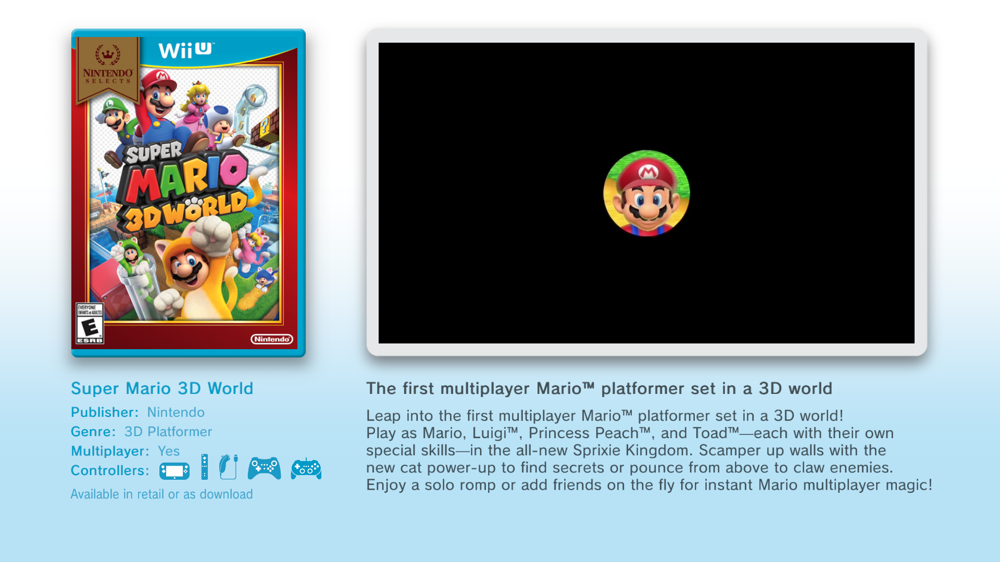
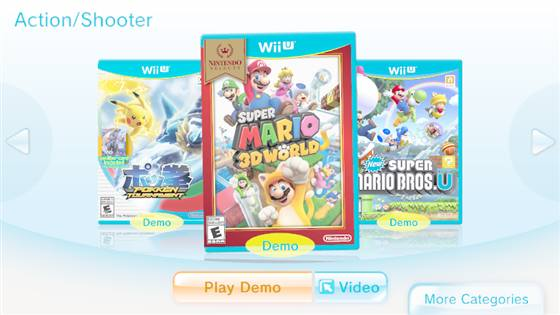
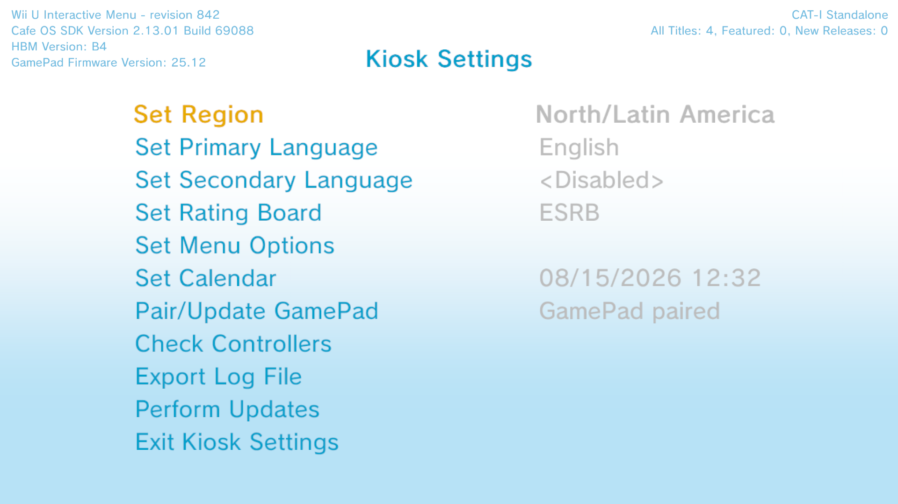
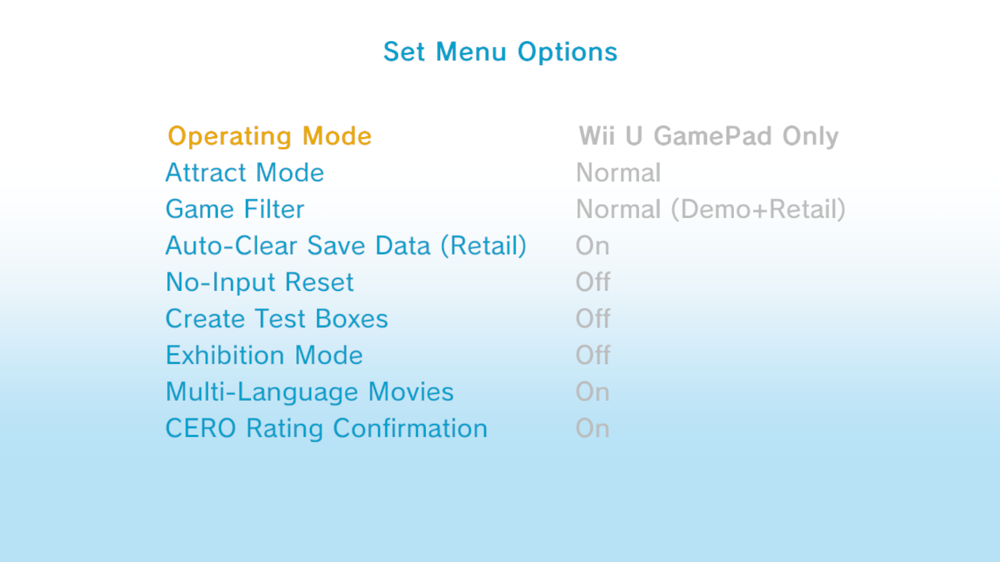
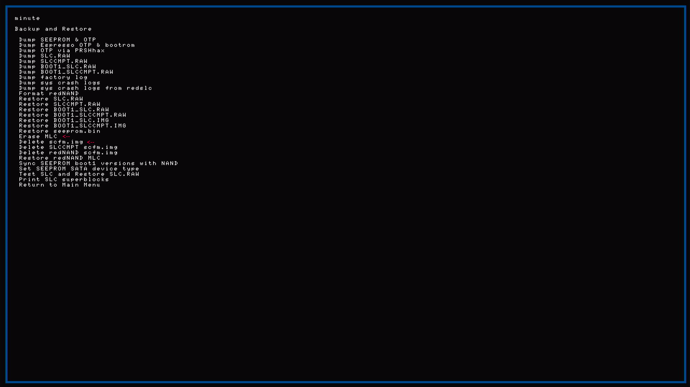

# Retail Wii U Kiosk Menu

This project aims to get the retail Wii U that you have in your home to run a Wii U CAT-I Kiosk Menu.

I've only tested this on my retail PAL Wii U. Some things may be different but the core logic stays the same. Kiosk Menu and System Config Tool should keep the same title IDs.

Like every homebrew project, this isn't 100% safe and a wrong action could corrupt your Wii U or brick it. Try to follow this guide closely and don't be afraid to look at the AI-helped version if needed.

[Why was AI used?](#why-was-ai-used)

Don't want to read? Scroll down until you reach the tutorial. Or [skip](#setup)

Want to remove it from the Wii U? [Here!](#removing)

## Retail Wii U running Kiosk Menu, NOT Kiosk OS

It's likely that Nintendo made the CAT-I like the retail unit and only added a few extra ports and software - this is why we can run the kiosk menu.

We won't be adding all kiosk features like the custom Home button menu, just the kiosk menu that shows titles and demos. See below.

Example photos from my retail Wii U taken with [Screenshot](https://hb-app.store/wiiu/Screenshot_WUPS). GamePad might seem too brightened but that's a bug and doesn't look like that in real life. 

  
  

And here's what the kiosk settings look like. This is where you're able to change the kiosk settings like region and rating. This is what you'll also see every time you boot into the menu: 

  
  

## Warnings

We will be modifying the SLC and MLC.

Back up your saves and keep them safe. The kiosk menu will create a user named "Sarah" over the main account. Other users may be safe.

**Don’t** use WiiUIdent Submit System Data while WIS-001/FW. This makes your Wii U think that it is a CAT-I.

## Setup

Here you'll learn how to set up your Wii U to run the kiosk menu.

Before we start you need to check your Wii U.

You need the following:

* A modded Wii U with [Aroma](https://wiiu.hacks.guide/aroma/getting-started.html)
* Plugin [FTPiiU](https://github.com/dimok789/ftpiiu) 
* [ISFShax](https://isfsh.ax/) and [Minute](https://github.com/StroopwafelCFW/minute_minute)
* A CAT-I kiosk dump that has kiosk menu
* System Config Tool - Retail version installed or the version that came with the dump. Native SCT Title ID should be `1f700500`.
* [wiiu-nandextract](https://github.com/koolkdev/wiiu-nandextract) · [wfs-tools](https://github.com/koolkdev/wfs-tools) for dumping CAT-I MLC and SLC.
* Windows 10/11 (or other OS if you can adapt the PowerShell / paths)
* WinSCP or other FTP client.
* Optional app for Aroma, makes rebooting easier: [App](https://hb-app.store/wiiu/WiiUReboot)

Continue with:

[SETUP.MD](SETUP.MD)

### What System Config Tool should I use?

Native System Config Tool is a `menu` while retail is a `game`.

If you want a retail System Config tool `13374454`:
* Can be launched from the Wii U menu.
* Is a newer version.
* Cannot be set as the default menu when booting.

If you want a native System Config tool `1f700500`:
* Cannot be launched from the Wii U menu.
* Is an older version.
* Can be set as the default menu when booting.

## Removing

You can stop using Kiosk Menu without undoing everything, or revert the SLC.

### Keep Home Menu, stop using kiosk (light)

1. Change the region back to what you want (if you changed it for demos).
2. Optional: remove demos you added with FTP.
3. If your Wii U reboots every ~2 min then use this [guide in ISSUES.MD](ISSUES.MD#turning-off-no-input-reset).

Kiosk menu / SCT can stay on MLC unused.

### Full undo (retail SLC again)

If you want to make really sure then you need to reflash the SLC backup you made before and erase the MLC and rebuild it with [this .ipx](https://github.com/StroopwafelCFW/wafel_setup_mlc). 

  

Then "Patch (sd) and boot IOS (slc)" to rebuild the MLC.

## Why was AI used?

Cursor AI was used to help speed up development and make PowerShell code. Some people don't like using AI projects and that's fine. 

This tutorial is made for people who don't want to use AI scripts and prefer fully made human tutorials.

## Screenshots

| Topic | Image |
|-------|--------|
| Retail SCT on Home | [RetailSystemConfigTool.png](../PNG/RetailSystemConfigTool.png) |
| SCT menu map | [HowSystemConfigLooksLike.MD](../PNG/HowSystemConfigLooksLike.MD) |
| Kiosk Settings menu map | [HowKioskSettingsLookLike.MD](../PNG/HowKioskSettingsLookLike.MD) |
| Kiosk Settings main (success) | [KioskSettingsMain.png](../PNG/Kiosk/Settings/KioskSettingsMain.png) |
| Set Menu Options | [KioskSettingsMenu.png](../PNG/Kiosk/Settings/KioskSettingsMenu.png) |
| Exit → Remove the SD card | [RemoveTheSDCard.png](../PNG/Kiosk/Settings/RemoveTheSDCard.png) |
| Kiosk Menu categories (DRC) | [SelectionMenuInDRC.png](../PNG/Kiosk/Menu/SelectionMenuInDRC.png) |
| Kiosk Menu demo carousel (DRC) | [Mario3DWorldDemoDRC.png](../PNG/Kiosk/Menu/Mario3DWorldDemoDRC.png) · [MarioTennisDemoDRC.png](../PNG/Kiosk/Menu/MarioTennisDemoDRC.png) |
| Kiosk Menu title page / video (TV) | [Mario3DWorldDemoTV.png](../PNG/Kiosk/Menu/Mario3DWorldDemoTV.png) · [MarioTennisDemoTV.png](../PNG/Kiosk/Menu/MarioTennisDemoTV.png) |
| Wii U logo splash (TV) | [KiosWiiULogoTV.png](../PNG/Kiosk/Menu/KiosWiiULogoTV.png) |
| Sarah / default user | [DefaultUserBeingSarah.png](../PNG/Kiosk/DefaultUserBeingSarah.png) |
| Stub / Non Playable Demo tiles | [KioskTitlesAndNonStubs.png](../PNG/Kiosk/KioskTitlesAndNonStubs.png) |
| minute Main menu | [Minute.png](../PNG/Minute/Minute.png) |
| Boot sysNAND | [HowToBootNativeWiiU.png](../PNG/Minute/HowToBootNativeWiiU.png) |
| Dump OTP / SLC / SLCCMPT | [WhatNeedsToBeDumpedOnYourConsole.png](../PNG/Minute/WhatNeedsToBeDumpedOnYourConsole.png) |
| Backup and Restore | [DumpAndRestore.png](../PNG/Minute/DumpAndRestore.png) |
| Patch (sd) → boot IOS (slc) | [IfMinuteIsntOnSLC.png](../PNG/Minute/IfMinuteIsntOnSLC.png) |
| Erase MLC / Delete scfm.img | [HowToDeleteMLCWiiU.png](../PNG/Minute/HowToDeleteMLCWiiU.png)  |

## Legal

Kiosk NAND/title/SCT data is copyrighted. You obtain dumps yourself.

- [ISFShax](https://isfsh.ax/) · [How to set up ISFShax](https://gbatemp.net/threads/how-to-set-up-isfshax.642258/)
- [wiiu-nandextract](https://github.com/koolkdev/wiiu-nandextract) · [wfs-tools](https://github.com/koolkdev/wfs-tools)

Thanks: [koolkdev](https://github.com/koolkdev), ISFShax / minute community, and Cursor AI ([cursor.com](https://cursor.com/)).