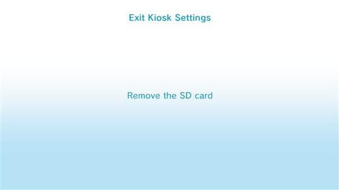
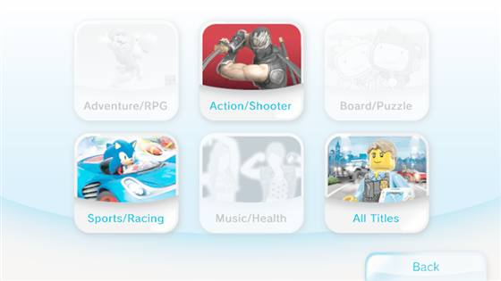
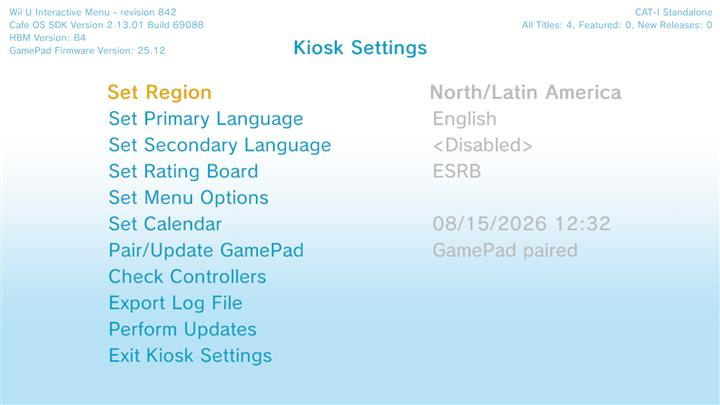
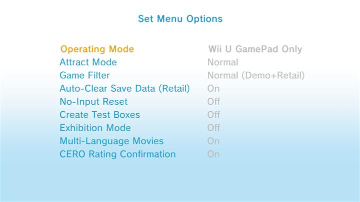

# Kiosk Settings — menu map

This is what you see every time when booting **Kiosk Menu** (before the title / video carousel).

Conventions match the [SCT menu map](HowSystemConfigLooksLike.MD):

| Markup | Meaning |
|--------|---------|
| `<…>` | Value you can change |
| `>>` | Opens another screen — linked below |

[AI usage](#ai-usage).


---

## Top of screen

**Top left**

```text
Wii U Interactive Menu - revision XXX
Cafe OS SDK Version X.XX.XX Build XXXXX
HBM Version: XX
GamePad Firmware Version: XX.XX
```

**Top right**

```text
CAT-I Standalone / Other   (depends on the dump)
All Titles: X, Featured: X, New Releases: X
```

Those counts update with **Region** and filter mode. They are not shown the same way on the main carousel.

---

## Kiosk Settings (main list)

- Set Region `<North/Latin America / Japan / Europe/Australia/NZ>`
- Set Primary Language `<English / Spanish / French / Portuguese>`
- Set Secondary Language `<Disabled / Spanish / French / Portuguese>`
- Set Rating Board `<ESRB/DJCTQ>` 
- [Set Menu Options >>](#set-menu-options)
- Set Calendar `<Time>`
- Pair/Update Gamepad `<GamePad paired / pair>`
- [Check Controllers >>](#check-controllers)
- [Export Log Files >>](#export-log-files)
- [Perform Updates >>](#perform-updates)
- [Exit Kiosk Settings >>](#exit-kiosk-settings)

---

## Set Menu Options

| Setting | Options | Notes |
|---------|---------|--------|
| Operating Mode | `<Multi-Controller / Wii U GamePad Only / Video Only>` | Use **Wii U GamePad Only** if you do not want the “No controllers connected” warning in Kiosk Show mode |
| Attract Mode | `<Normal / Switched / Movie on TV and GamePad>` | When idle. Needs the Attract app installed. Normal = TV shows video, Switched = GamePad shows video. |
| Game Filter | `<Demo + Retail / Demo Titles Only / Retail Title Only>` | Does not show retail games that are installed. |
| Auto-Clear Save Data (Retail) | `<On / Off>` | |
| No-Input Reset | `<On / Off>` | When **On**, idle can reboot other titles (~2 min); Kiosk Menu itself often stays up. Prefer **Off**|
| Create Test Boxes | `<On / Off>` | Kiosk debug settings. Needs titles to be valid and not have kiosk meta. You can ignore it. |
| Exhibition Mode | `<On / Off>` | Shows only movies, not games. May say “No movies have been installed” without title isntalled. See more in kiosk titles|
| Multi-Language Movies | `<On / Off>` | |
| CERO Rating Confirmation | `<On / Off>` | |

---

## Check Controllers

Controller slots appear here (empty rows until something is connected).

Sensor Bar Position: `UPPER` / `LOWER` (use **+Control Pad** to change).

---

## Export Log Files

Set Store ID (`X X X` — 3 letters + `X X X X X` — 5 numbers)

Save Log Files To SD Card

---

## Perform Updates

Needs an update disc (CAT-I update disc).

---

## Exit Kiosk Settings

### SD inserted

Shows **Remove the SD card** before continuing to the show / carousel path:



### No SD

Press **A** to start the kiosk menu.

---

## After exit — Kiosk Menu

Category pick and demo carousel (GamePad). Full-size originals: `Kiosk/Menu/`.

<p>
  
  
</p>


---

## Screenshots 

<p>
  
  
</p>

# AI usage

Cursor was used to check spelling and fix a few bugs. Mostly human documentation.